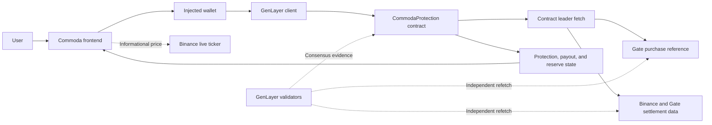
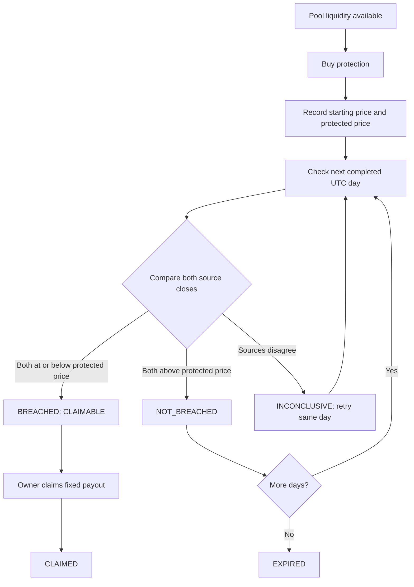
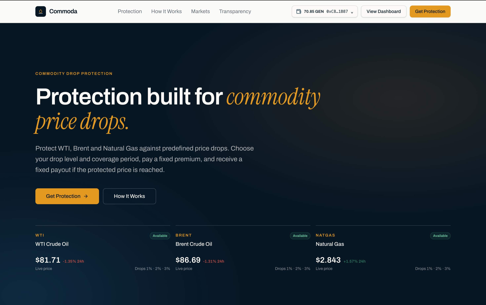
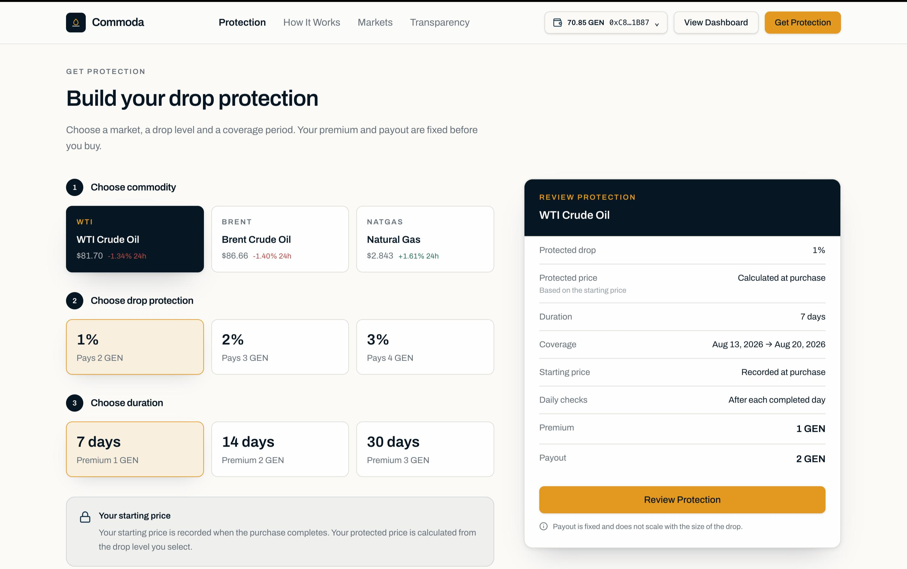
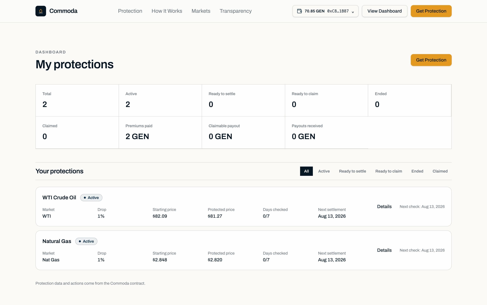

# Commoda

## Commodity price protection on GenLayer

Commoda offers fixed-payout price protection across three curated commodity markets. Users choose a market, a protected drop level, and a coverage period. If the protected price is reached during coverage, the payout becomes claimable.

Commoda checks market data through GenLayer validator consensus. The contract records the starting price, applies fixed terms, verifies completed UTC coverage days, and manages the resulting payout and reserves.

Commoda v1 supports three curated markets: WTI Crude Oil, Brent Crude Oil, and Natural Gas. It is a price-protection product, not a trading terminal, prediction market, or official exchange settlement product.

| Deployment | Value |
| --- | --- |
| Network | GenLayer Bradbury Testnet |
| Chain ID | `4221` |
| Contract | [`0xf03891AB3223D471f677274976d1e35d53640A13`](https://explorer-bradbury.genlayer.com/address/0xf03891AB3223D471f677274976d1e35d53640A13) |
| Source | [`contract/CommodaProtection.py`](contract/CommodaProtection.py) |
| Source SHA-256 | `7c9a393399585fe110d2ea03665c43110a9af3452f09d2728f72eb4d41cb48f3` |

## Why Commoda

Commoda presents predefined protection terms and settlement rules in a simple, transparent format. Users receive a defined outcome before they buy:

- a selected commodity;
- a 1%, 2%, or 3% protected drop;
- a 7-, 14-, or 30-day coverage period;
- a fixed GEN premium; and
- a fixed GEN payout.

The result is simple to evaluate. The user knows the terms in advance, and a confirmed price breach makes the payout claimable without a discretionary claims decision.

## Key innovations

- **Fixed-payout commodity protection** with curated WTI, Brent, and Natural Gas markets.
- **Completed-day settlement** that excludes the purchase day and checks each covered UTC day in order.
- **Dual-source confirmation** using Binance and Gate historical prices for settlement.
- **Inconclusive retry path** when sources disagree, instead of forcing a result.
- **Transparent reserve accounting** that keeps payout liability backed by the protection pool.
- **Contract-controlled claimability** based on confirmed market evidence, not frontend state or user-submitted prices.

## Technical pillars

1. **GenLayer consensus on external data** — validators independently retrieve and verify the market evidence used by the contract.
2. **Gate purchase reference** — the starting price is obtained from the matching Gate futures ticker and accepted only when validator observations are within 5 bps.
3. **Binance + Gate settlement** — both historical sources must agree on whether the protected price was reached.
4. **Ordered settlement** — `settle_protection` accepts only a protection ID; the contract always settles its stored earliest unresolved date.
5. **Fixed-point economics** — trigger prices and accounting use integer values, not floating-point arithmetic.
6. **Reserved payouts** — the contract tracks pool balance, reserved liability, and available liquidity directly.

## How it works

1. Select WTI, Brent, or Natural Gas.
2. Choose a 1%, 2%, or 3% protected drop.
3. Choose 7, 14, or 30 days of coverage.
4. Review the fixed premium and payout returned by the contract.
5. Purchase protection. The contract records the Gate starting price and calculates the protected price.
6. After each completed UTC day, an authorized caller can request settlement for the next unresolved day.
7. Binance and Gate historical prices are checked independently through GenLayer consensus.
8. A confirmed breach makes the protection claimable. If every covered day clears, the protection expires.

The purchase day is excluded. If `next_date` is August 13, settlement is not allowed during August 13 UTC and becomes eligible at August 14 00:00 UTC. This rule is enforced by the contract.

### Price-drop calculation

The contract accepts integer event percentages in `{1, 2, 3}` and calculates the protected price using fixed-point integer arithmetic:

```text
event_bps = event_percent * 100
trigger_price = reference_price * (10000 - event_bps) // 10000
```

For example, a $82.00 starting price with 1% protection produces an $81.18 protected price. If both settlement closes are at or below that price on a completed covered day, the day is `BREACHED`.

## System architecture



The frontend Binance ticker is informational only. It never determines the purchase premium, starting price, protected price, settlement result, or claimability. The contract is authoritative for protocol state, while GenLayer validators provide the consensus evidence used by the contract.

## Protection lifecycle



## Supported markets and fixed terms

| Contract market | Display name |
| --- | --- |
| `WTI` | WTI Crude Oil |
| `BRENT` | Brent Crude Oil |
| `NATGAS` | Natural Gas |

Markets are intentionally curated in v1. Market creation and source mapping are not permissionless.

Drop levels are `1%`, `2%`, and `3%`. The contract terms are fixed:

| Duration | Premium | 1% payout | 2% payout | 3% payout |
| --- | ---: | ---: | ---: | ---: |
| 7 days | 1 GEN | 2 GEN | 3 GEN | 4 GEN |
| 14 days | 2 GEN | 4 GEN | 5 GEN | 6 GEN |
| 30 days | 3 GEN | 6 GEN | 8 GEN | 10 GEN |

## UI Tour

### Homepage and market overview



Shows the supported commodity markets, current informational prices, and the path into protection selection.

### Get Protection flow



Shows how a user selects a commodity, drop level, and coverage period before reviewing the contract-backed premium and payout.

### Dashboard and settlement management



Shows active protections, completed checks, claimable payouts, and the actions available when settlement or claiming is due.

## Settlement outcomes

For each covered day, the contract records one of these results:

| Contract result | Frontend label | Meaning |
| --- | --- | --- |
| `UNPROCESSED` | Waiting | The day has not been settled. |
| `BREACHED` | Protected price reached | Both sources confirm the protected drop. |
| `NOT_BREACHED` | No protected drop | Both sources remain above the protected price. |
| `INCONCLUSIVE` | Checking again | The sources disagree and the same day can be retried. |

`INCONCLUSIVE` is not treated as a forced failure or success. The protection remains active, `next_date` does not advance, `settled_days` does not increase, reserves stay locked, and later days remain blocked.

Protection states are shown to users as:

| Contract state | Frontend label |
| --- | --- |
| `ACTIVE` | Active |
| `CLAIMABLE` | Ready to claim |
| `EXPIRED` | Ended |
| `CLAIMED` | Paid |

## Data sources and verification

| Purpose | Provider | WTI | Brent | Natural Gas |
| --- | --- | --- | --- | --- |
| Purchase reference | Gate futures ticker | `CL_USDT` | `BZ_USDT` | `NG_USDT` |
| Historical settlement | Binance Futures | `CLUSDT` | `BZUSDT` | `NATGASUSDT` |
| Historical settlement | Gate futures candles | `CL_USDT` | `BZ_USDT` | `NG_USDT` |
| Frontend informational ticker | Binance Futures | `CLUSDT` | `BZUSDT` | `NATGASUSDT` |

For purchase, the leader and validators independently fetch the matching Gate ticker. The observations must be within 5 bps before the starting price is accepted.

For settlement, the contract requests the exact UTC daily candle or row for the stored date. Binance timestamps must match the target UTC midnight and its final millisecond; Gate must return the exact target-day row. Adjacent-day data is rejected. Validators independently refetch the configured sources and verify the evidence values, dates, timestamps, and close prices before the contract computes the settlement result.

## Pool and reserve model

The contract maintains the following invariant:

```text
reserved_liability <= pool_balance
available_liquidity = pool_balance - reserved_liability
```

| Event | Pool balance | Reserved liability |
| --- | --- | --- |
| Purchase | `+ premium` | `+ payout` |
| Intermediate `NOT_BREACHED` | Unchanged | Unchanged |
| `INCONCLUSIVE` | Unchanged | Unchanged |
| `BREACHED` | Unchanged | Remains locked until claim |
| `EXPIRED` | Unchanged | `- payout` |
| Claim | `- payout` | `- payout` |

Purchases require enough available liquidity, including the incoming premium, to reserve the requested payout. The contract enforces this rule. The owner can withdraw only unreserved liquidity.

## Permissions and liveness

| Action | Allowed caller |
| --- | --- |
| Fund pool | Contract owner |
| Withdraw unreserved GEN | Contract owner |
| Pause or resume purchases | Contract owner |
| Add or remove operator | Contract owner |
| Purchase protection | Any wallet, subject to terms and liquidity |
| Settle personal protection | Protection owner |
| Settle any protection | Contract owner or approved operator |
| Claim payout | Protection owner only |

The owner may approve at most five settlement operators. Operators can trigger settlement but cannot choose the date, evidence, outcome, payout, or claimant.

Settlement is caller-triggered. The contract does not submit a transaction when UTC time changes. A protection owner, operator, or optional keeper can trigger a due settlement. If nobody calls, the state remains safe but progression is delayed. This is an operational liveness consideration, not a settlement-ordering or authorization bypass.

Pausing blocks new purchases only. Existing protections can still settle, retry inconclusive days, and claim payouts.

## Frontend and wallet architecture

The frontend uses React, TypeScript, TanStack Router, TanStack Query, Wagmi, RainbowKit, and GenLayerJS.

- Public contract reads are wallet-independent.
- Sender-aware reads are used for authorization-sensitive readiness and owner-specific views.
- Dashboard loading uses bounded summary, attention, and owner-card reads rather than an unbounded N+1 loader.
- Protection detail loads bounded history. Verification evidence is available per completed day and is shown in the expandable verification section.
- RainbowKit exposes an injected wallet connector only.
- Signed writes use the active Wagmi connector provider, validate the selected account and Bradbury chain, and send the exact contract arguments and native GEN value.
- Signed transactions are never automatically resubmitted.

Transaction progress is presented as:

```text
Preparing → Awaiting wallet → Submitted → Processing → Accepted
```

`Accepted` is the user-facing GenLayer transaction success state.

## What Commoda does not trust

Commoda does not use:

- user-submitted market prices;
- the frontend informational price as protocol evidence;
- a single settlement source alone;
- a caller-selected settlement date; or
- frontend readiness checks as the security boundary.

The contract controls terms, lifecycle, permissions, reserves, settlement order, and claims. GenLayer validators verify the external evidence needed for purchase and settlement.

## Security properties

The contract and direct test suites cover:

- same-day and future settlement blocked at contract level;
- earliest-unresolved and out-of-order settlement protection;
- inconclusive results blocking later dates while remaining retryable;
- conclusive day results that cannot be rewritten;
- breach stopping further settlement;
- pause not blocking settlement, retry, or claims;
- unauthorized settlement callers rejected;
- only the protection owner able to claim;
- exact premium enforcement;
- reserved funds protected from withdrawal;
- independent Binance and Gate settlement evidence;
- source failure preserving contract state; and
- no user-submitted market-price evidence.

## Repository structure

```text
commoda/
├── contract/
│   └── CommodaProtection.py
├── frontend/
│   ├── src/
│   │   ├── lib/commoda/
│   │   └── routes/
│   └── package.json
├── tests/
│   └── direct/
├── docs/
│   └── architecture.md
└── README.md
```

## Development and testing

Frontend development and validation:

```bash
cd frontend
bun install
bun run dev
bun x tsc --noEmit
bun run build
```

Contract validation from the repository root:

```bash
pytest -q tests/direct
genvm-lint check contract/CommodaProtection.py
genvm-lint schema contract/CommodaProtection.py
genvm-lint typecheck contract/CommodaProtection.py
```

Previously recorded validation results:

| Check | Result |
| --- | --- |
| Production-focused direct suite | 83 passed, 0 failed |
| Frontend `bun x tsc --noEmit` | PASS |
| Frontend `bun run build` | PASS |
| GenVM lint and validation | PASS |
| Contract typecheck | PASS |
| Python compile/compileall | PASS |
| Production schema | 34 methods: 25 views, 9 writes |

## Operational considerations

- Settlement is caller-triggered; UTC time passing alone does not submit a transaction.
- Each protection/day requires its own settlement transaction.
- Higher policy volume increases settlement transaction volume.
- A keeper or bot can automate calls for due protections.
- Protection owners can settle their own protections without waiting for an administrator.

## Responsibility boundaries

| Component | Responsibility |
| --- | --- |
| Frontend | UX, wallet interaction, contract reads, informational Binance prices |
| Wallet | User authorization and transaction signature |
| Commoda contract | Terms, lifecycle, reserves, permissions, settlement, and claims |
| GenLayer validators | Independent external-evidence verification and consensus |
| Gate | Purchase reference and settlement evidence |
| Binance | Settlement evidence and informational frontend ticker |
| Operator or keeper | Liveness trigger only; cannot choose result or date |

## Links

- [Contract architecture](docs/architecture.md)
- [Production contract](contract/CommodaProtection.py)
- [Direct tests](tests/direct/)
- [GitHub repository](https://github.com/jason4185/commoda)
