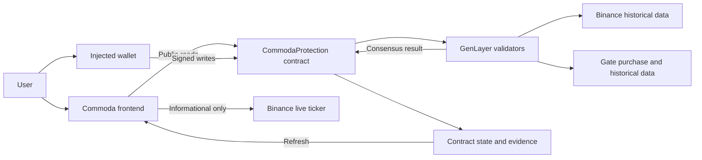
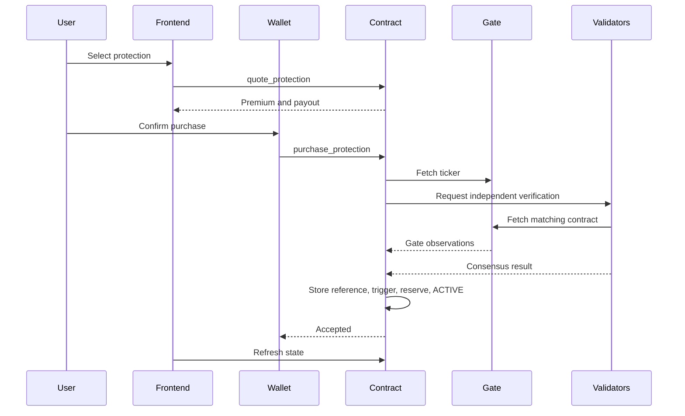
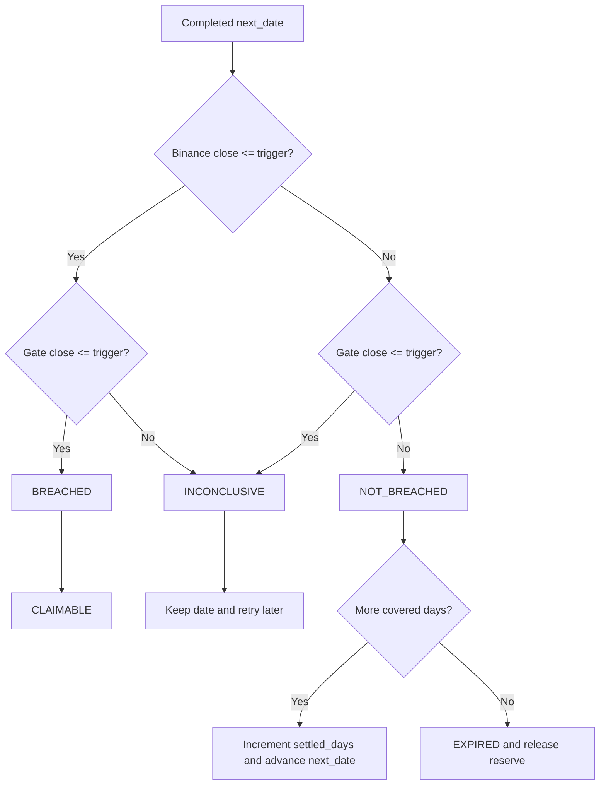
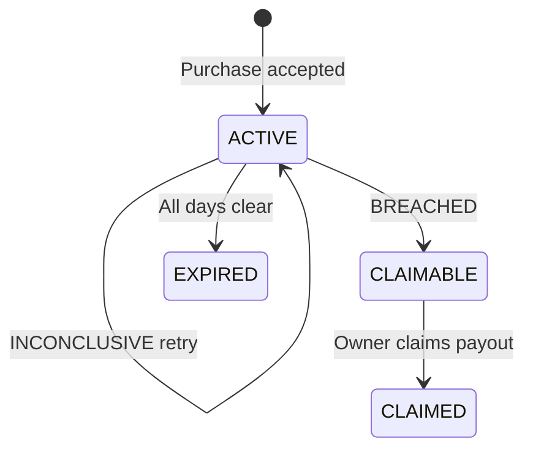
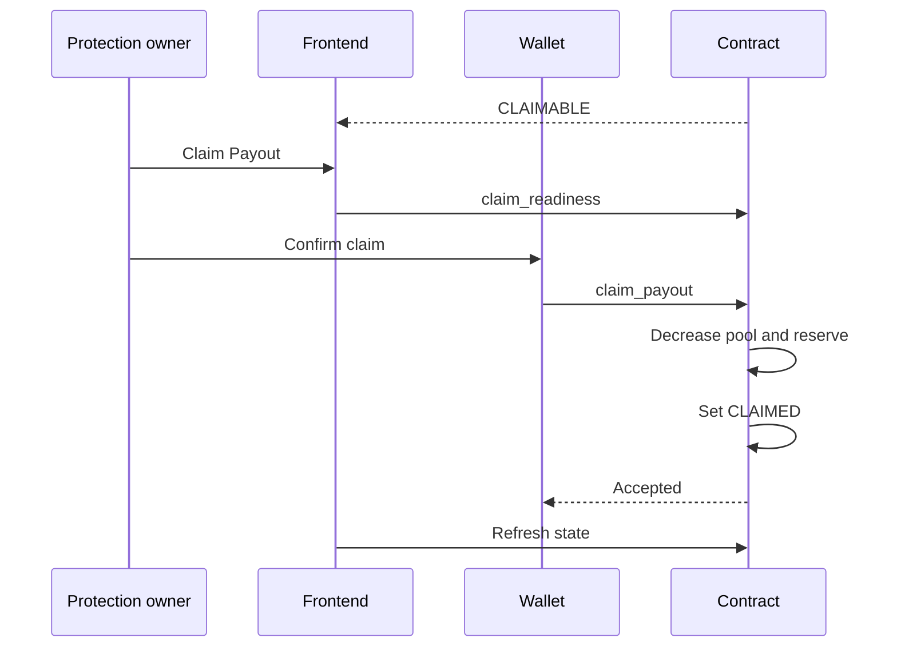
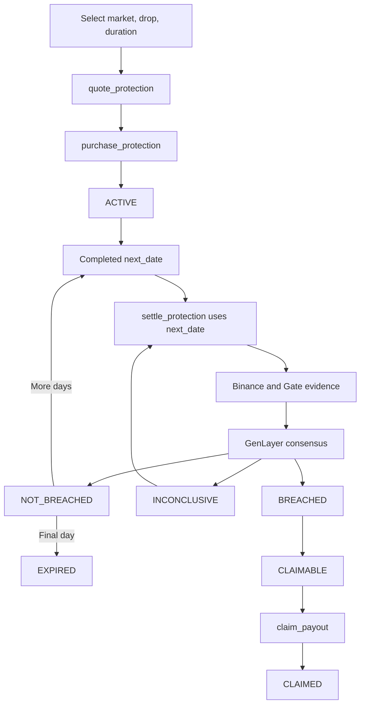

# Commoda

## Commodity Price-Drop Protection on GenLayer

Commoda is a parametric commodity downside-protection protocol built on GenLayer. Users choose a commodity, a predefined drop level, and a coverage period. The contract records a Gate market reference at purchase, calculates a protected price, checks completed UTC days against independent historical market data, and makes a fixed GEN payout claimable when the protected drop is confirmed.

Commoda v1 intentionally supports three curated perpetual-market benchmarks. It is not a prediction market, trading terminal, or official CME/ICE settlement product.

| Deployment | Value |
| --- | --- |
| Network | GenLayer Bradbury Testnet |
| Chain ID | `4221` |
| Contract | [`0xf03891AB3223D471f677274976d1e35d53640A13`](https://explorer-bradbury.genlayer.com/address/0xf03891AB3223D471f677274976d1e35d53640A13) |
| Source | [`contract/CommodaProtection.py`](contract/CommodaProtection.py) |
| Source SHA-256 | `7c9a393399585fe110d2ea03665c43110a9af3452f09d2728f72eb4d41cb48f3` |

## Product scope

### Supported markets

| Contract market | Display name |
| --- | --- |
| `WTI` | WTI Crude Oil |
| `BRENT` | Brent Crude Oil |
| `NATGAS` | Natural Gas |

These are curated v1 markets. Market creation and source mapping are not permissionless.

### Fixed terms

Drop levels are `1%`, `2%`, and `3%`. Durations are `7`, `14`, and `30` days.

| Duration | Premium | 1% payout | 2% payout | 3% payout |
| --- | ---: | ---: | ---: | ---: |
| 7 days | 1 GEN | 2 GEN | 3 GEN | 4 GEN |
| 14 days | 2 GEN | 4 GEN | 5 GEN | 6 GEN |
| 30 days | 3 GEN | 6 GEN | 8 GEN | 10 GEN |

Terms are fixed in the contract. The purchase day is excluded; the first covered settlement date is the next UTC calendar day.

### Price-drop model

The public `event_percent` values are integers in `{1, 2, 3}`. The contract uses integer arithmetic:

```text
event_bps = event_percent * 100
trigger_price = reference_price * (10000 - event_bps) // 10000
```

For example, an `$82.00` starting price with 1% protection produces an `$81.18` protected price. If both settlement closes are at or below it on a completed covered day, the result is `BREACHED`.

## Why GenLayer

The decisive facts exist outside the contract: purchase needs a current Gate reference, while settlement needs Binance and Gate historical prices for an exact UTC day. A conventional deterministic contract cannot independently retrieve and verify those web sources.

GenLayer supplies the nondeterministic execution and validator consensus used to retrieve and verify the evidence. After consensus, the Commoda contract deterministically applies terms, comparisons, accounting, and lifecycle transitions.

Commoda does not trust user-provided prices, the frontend display price, one settlement source alone, a caller-selected settlement date, or frontend readiness checks.

## Architecture



The frontend Binance ticker is informational only. It is not the purchase reference, authoritative trigger, or settlement authority.

### Frontend

The frontend uses React, TypeScript, TanStack Router, TanStack Query, Wagmi, RainbowKit, and GenLayerJS. It uses an injected wallet connector only and has no application database or authoritative browser-persisted protocol state.

### Intelligent contract

[`CommodaProtection.py`](contract/CommodaProtection.py) owns fixed terms, purchase reference consensus, trigger construction, pool and reserve accounting, evidence versions, settlement, claims, lifecycle state, and permissions.

### Data sources

| Purpose | Provider | WTI | Brent | Natural Gas |
| --- | --- | --- | --- | --- |
| Purchase reference | Gate futures ticker | `CL_USDT` | `BZ_USDT` | `NG_USDT` |
| Historical settlement | Binance Futures | `CLUSDT` | `BZUSDT` | `NATGASUSDT` |
| Historical settlement | Gate futures candles | `CL_USDT` | `BZ_USDT` | `NG_USDT` |
| Frontend informational ticker | Binance Futures | `CLUSDT` | `BZUSDT` | `NATGASUSDT` |

## Purchase flow

1. The user selects market, drop level, and duration.
2. The frontend calls `quote_protection`.
3. The contract returns the fixed premium, payout, and liquidity information.
4. The user signs `purchase_protection(market, duration, event_percent)`.
5. The contract fetches the matching Gate ticker.
6. Validators independently fetch the same Gate contract.
7. Prices must satisfy the 5-basis-point equivalence rule.
8. The accepted reference and integer protected price are stored.
9. The exact premium enters the pool and the full payout becomes reserved.
10. The protection becomes `ACTIVE` with `next_date` set to the next UTC day.
11. The transaction reaches the frontend `Accepted` state and the frontend refreshes contract state.



The frontend Binance price never determines payable value, starting price, or trigger.

## Daily settlement

The only settlement write is:

```text
settle_protection(protection_id)
```

It accepts no caller-selected date. The contract always uses the stored `p.next_date`, which guarantees earliest-unresolved-date ordering.

If `next_date` is August 13, settlement fails throughout August 13 UTC and becomes eligible at August 14 00:00 UTC. The contract enforces the strict completed-day rule itself; frontend checks are not the security boundary.

Settlement verifies the exact Binance daily candle and Gate daily row for that date. Validators independently refetch the evidence and verify source symbol, date, timestamps, positive close values, and the comparison against the stored protected price.



### INCONCLUSIVE

`INCONCLUSIVE` is a settlement result, not necessarily a failed transaction. A transaction can be `Accepted` while the day remains unresolved.

When Binance and Gate disagree:

- the protection remains `ACTIVE`;
- `next_date` is unchanged;
- `settled_days` is unchanged;
- reserve remains locked;
- later dates remain blocked;
- a later call retries the same date.

Retries create a new evidence version. Historical versions remain queryable, and the protection day result records the exact version used.

### Protection lifecycle



Day-level states map in the frontend as follows:

| Contract | Frontend |
| --- | --- |
| `UNPROCESSED` | Waiting |
| `BREACHED` | Protected price reached |
| `NOT_BREACHED` | No protected drop |
| `INCONCLUSIVE` | Checking again |

Protection states map as follows:

| Contract | Frontend |
| --- | --- |
| `ACTIVE` | Active |
| `CLAIMABLE` | Ready to claim |
| `EXPIRED` | Ended |
| `CLAIMED` | Paid |

## Claim flow

1. A conclusive `BREACHED` result moves the protection to `CLAIMABLE`.
2. The fixed payout remains reserved.
3. Only the protection owner may call `claim_payout`.
4. The contract transfers the payout and decreases pool balance and reserved liability.
5. The protection becomes `CLAIMED`.
6. The frontend refreshes protection, user, attention, and pool state.



## Reserve and accounting model

The core invariant is:

```text
reserved_liability <= pool_balance
available_liquidity = pool_balance - reserved_liability
```

| Event | Pool balance | Reserved liability |
| --- | --- | --- |
| Purchase | `+ premium` | `+ payout` |
| Intermediate `NOT_BREACHED` | unchanged | unchanged |
| `INCONCLUSIVE` | unchanged | unchanged |
| `BREACHED` | unchanged | remains locked |
| `EXPIRED` | unchanged | `- payout` |
| Claim | `- payout` | `- payout` |

Purchases require sufficient available liquidity, including the incoming premium, to reserve the requested payout. The contract enforces this rule. The owner can withdraw only unreserved liquidity.

## Permissions, pause, and liveness

| Action | Allowed caller |
| --- | --- |
| Fund pool | Contract owner |
| Withdraw unreserved GEN | Contract owner |
| Pause or resume purchases | Contract owner |
| Add or remove operator | Contract owner |
| Purchase protection | Any wallet, subject to terms and liquidity |
| Settle personal protection | Protection owner |
| Settle any protection | Contract owner or approved operator |
| Claim payout | Protection owner only |

The owner may approve at most five settlement operators. Operators can trigger settlement but cannot choose the date, evidence, outcome, payout, or claimant.

Settlement is caller-triggered. The contract does not submit a transaction when UTC time changes. Current callers can be the protection owner, contract owner, or approved operator; an optional keeper/bot can automate due calls. If nobody calls, state remains safe but progression is delayed. This is an operational liveness consideration, not a date-ordering or authorization bypass.

Pausing blocks new purchases only. Existing protections can still settle, retry inconclusive dates, and claim payouts.

## Evidence and fixed-point safety

Binance settlement checks the exact UTC daily candle: opening timestamp equals target midnight and closing timestamp equals target midnight plus `86,400,000 - 1` milliseconds. Gate validates the exact target-day row. Adjacent-day, malformed, oversized, unavailable, wrong-symbol, and wrong-timestamp responses do not advance state.

Prices use integer fixed-point scale `100000000`. The parser rejects malformed decimals, negative or zero values, scientific notation, excessive precision, and impossible prices. Contract calculations do not use Python floating-point arithmetic.

For purchase, the leader and validators independently fetch the matching Gate ticker and accept only within 5 bps. For settlement, validators independently refetch Binance and Gate historical evidence; they do not merely validate JSON shape.

## Frontend architecture

Public reads are wallet-independent. Sender-aware GenLayerJS reads are used for authorization-sensitive views including owner protection cards, `settlement_readiness`, and `claim_readiness`.

The dashboard's bounded initial reads are:

```text
get_user_summary(owner)
get_user_attention(owner, 0, 20)
get_owner_protection_cards(owner, 0, 20)
```

Protection detail loads protection data, bounded history, and sender-aware readiness. Evidence is lazy-loaded when a completed day is expanded. There is no unbounded ID → protection → readiness → history N+1 loader.

Wagmi and RainbowKit expose an injected wallet only. Signed writes use `activeConnector.getProvider()`. Before writing, the frontend verifies the EIP-1193 provider, `eth_accounts`, selected account, Bradbury chain ID, contract address, exact arguments, and exact native GEN value. It does not use `window.ethereum` as the canonical write provider or automatically resubmit signed transactions.

Transaction progress is:

```text
Preparing → Awaiting wallet → Submitted → Processing → Accepted
```

`Accepted` is the user-facing GenLayer transaction success state. The frontend does not present `Finalized` as that state.

## End-to-end flow



## Security properties

The current contract and direct tests cover:

- same-day and future settlement blocked at contract level;
- earliest unresolved date and out-of-order settlement protection;
- inconclusive results block later days and remain retryable;
- conclusive day results cannot be rewritten;
- breach stops further settlement;
- pause does not block settlement, retry, or claim;
- unauthorized settlement callers rejected;
- only the protection owner can claim;
- exact premium enforced;
- reserved funds protected from withdrawal;
- Binance and Gate independently used for settlement;
- source failure preserves state;
- no user-submitted market-price evidence.

## Repository structure

```text
commoda/
├── contract/
│   ├── CommodaProtection.py
│   └── CommodaHistoricalTest.py
├── frontend/
│   ├── src/
│   │   ├── lib/commoda/
│   │   └── routes/
│   └── package.json
├── tests/
│   └── direct/
├── docs/
│   └── architecture.md
└── README.md
```

`CommodaHistoricalTest.py` is test-only and is not the production deployment authority.

## Local development and validation

```bash
cd frontend
bun install
bun run dev
bun x tsc --noEmit
bun run build
```

From the repository root:

```bash
pytest -q tests/direct
genvm-lint check contract/CommodaProtection.py
genvm-lint schema contract/CommodaProtection.py
genvm-lint typecheck contract/CommodaProtection.py
```

The historical suite uses local mocked source responses to test past dates. It is test-only and does not change the production deployment.

## Test and audit status

Latest recorded validation:

| Check | Result |
| --- | --- |
| Production-focused direct suite | 83 passed, 0 failed |
| Complete direct suite | 91 passed, 0 failed |
| Historical suite | 8 passed, 0 failed |
| Frontend `bun x tsc --noEmit` | PASS |
| Frontend `bun run build` | PASS |
| GenVM lint and validation | PASS |
| Contract typecheck | PASS |
| Python compile/compileall | PASS |
| Production schema | 34 methods: 25 views, 9 writes |

The audit also confirmed sender-aware readiness reads, correct global protection-ID resolution, explicit same-day boundary behavior, and historical Gate ticker test coverage.

## Operational considerations

1. Settlement is caller-triggered; UTC time passing alone does not submit a transaction.
2. Each protection/day requires its own settlement transaction.
3. High policy volume increases settlement transaction volume linearly.
4. A keeper or bot can automate calls for due protections.
5. Protection owners can settle their own protections without waiting for an administrator.

## Responsibility boundaries

| Component | Responsibility |
| --- | --- |
| Frontend | UX, wallet interaction, contract reads, informational Binance prices |
| Wallet | User authorization and transaction signature |
| Commoda contract | Terms, lifecycle, reserves, permissions, settlement, claims |
| GenLayer validators | Independent external-evidence verification and consensus |
| Gate | Purchase reference and settlement evidence |
| Binance | Settlement evidence and informational frontend ticker |
| Operator or keeper | Liveness trigger only; cannot choose result or date |

## Further documentation

- [Contract architecture](docs/architecture.md)
- [Production contract](contract/CommodaProtection.py)
- [Direct tests](tests/direct/)
- [GitHub repository](https://github.com/jason4185/commoda)
